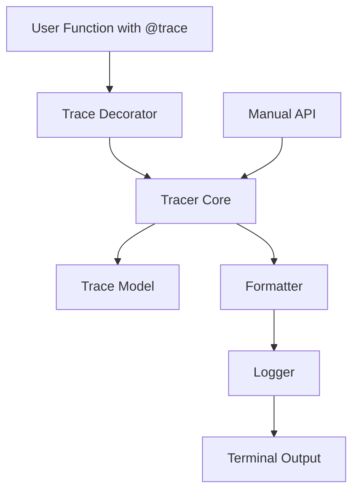
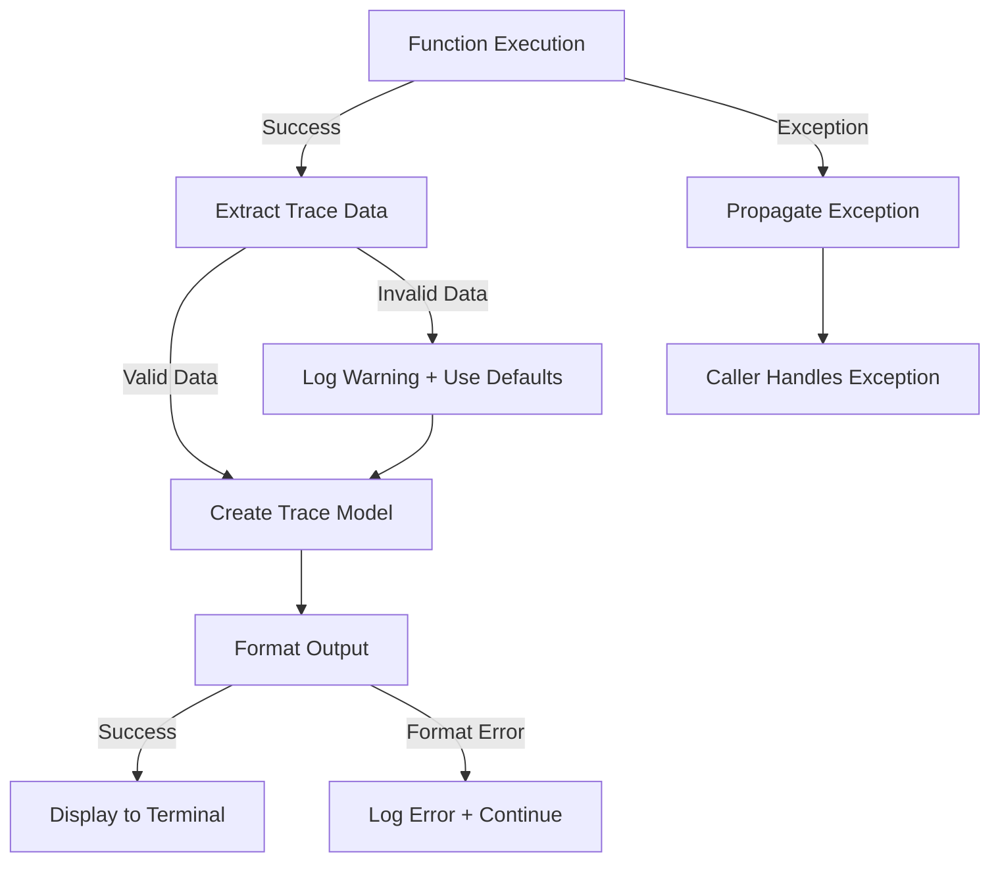
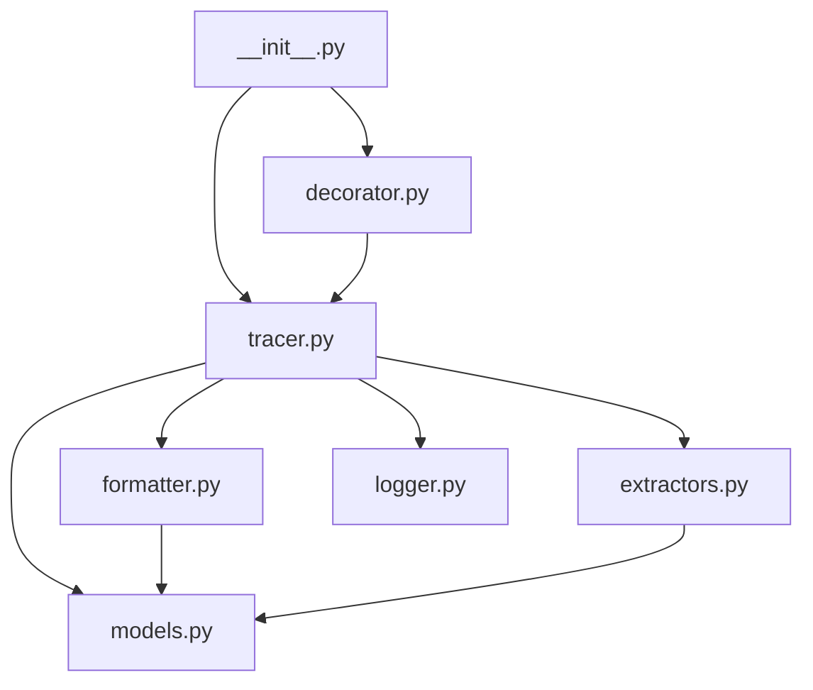

# Design Document: AgentForge v0.1 Tracing Library

## Overview

AgentForge v0.1 is a focused Python tracing library designed to capture and display AI request execution details with minimal developer effort. The library provides a decorator-based API that wraps AI request functions, automatically capturing timing, token usage, costs, prompts, and responses, then displays them in a beautifully formatted terminal output.

### Core Design Principles

1. **Zero-Configuration Usage**: The library works out-of-the-box with sensible defaults
2. **Non-Invasive Tracing**: Tracing never breaks application execution or alters return values
3. **Beautiful Output**: Terminal output is readable, structured, and visually appealing using the rich library
4. **Type Safety**: All data models use Pydantic for validation and type checking
5. **Graceful Degradation**: Missing or invalid trace data results in warnings, not crashes

### Scope

**In Scope for v0.1:**
- Single AI request tracing via decorator
- Terminal output formatting
- Manual trace creation API
- Token and cost extraction from common AI providers

**Out of Scope for v0.1:**
- Multi-request tracing or spans
- Persistent storage or trace history
- Web UI or dashboard
- Distributed tracing
- Performance profiling beyond basic timing

## Architecture

### High-Level Component Diagram




### Component Interaction Flow

1. **Decoration Phase**: Developer applies `@trace` decorator to an AI request function
2. **Invocation Phase**: When the decorated function is called, the decorator intercepts the call
3. **Timing Phase**: Tracer records start time before executing the wrapped function
4. **Execution Phase**: Original function executes and returns a result
5. **Capture Phase**: Tracer extracts model, tokens, cost, prompt, and response from the result
6. **Model Phase**: Captured data is validated and stored in a Trace_Model instance
7. **Formatting Phase**: Formatter transforms the Trace_Model into rich-formatted text
8. **Display Phase**: Logger renders the formatted trace to the terminal
9. **Return Phase**: Original return value is passed back to the caller

### Error Handling Flow




## Components and Interfaces

### 1. Trace Decorator (`@trace`)

**Purpose**: Provides the primary user-facing API for tracing AI requests.

**Implementation Strategy**:
- Implemented using `functools.wraps` to preserve function metadata
- Wraps the target function in a timing and capture context
- Delegates trace creation to the Tracer core component

**Interface**:
```python
def trace(func: Callable) -> Callable:
    """
    Decorator that traces AI request function execution.
    
    Captures timing, model info, tokens, cost, prompt, and response.
    Displays formatted trace to terminal after execution.
    
    Args:
        func: The function to trace (should return AI response object)
    
    Returns:
        Wrapped function with identical signature and return type
    """
    @functools.wraps(func)
    def wrapper(*args, **kwargs):
        # Implementation details in next section
        pass
    return wrapper
```

**Key Responsibilities**:
- Preserve wrapped function signature, name, and docstring
- Measure execution time with high precision
- Capture function result for trace extraction
- Propagate exceptions without suppression
- Invoke Tracer to process and display trace


### 2. Tracer Core

**Purpose**: Orchestrates trace capture, extraction, and display.

**Interface**:
```python
class Tracer:
    """Core tracing engine for AgentForge."""
    
    def __init__(self, logger: Logger = None, formatter: Formatter = None):
        """
        Initialize tracer with optional custom logger and formatter.
        
        Args:
            logger: Custom logger instance (defaults to RichLogger)
            formatter: Custom formatter instance (defaults to RichFormatter)
        """
        self.logger = logger or RichLogger()
        self.formatter = formatter or RichFormatter()
    
    def capture_trace(
        self,
        result: Any,
        latency: float,
        func_name: str = None
    ) -> None:
        """
        Capture and display a trace from function execution result.
        
        Args:
            result: Return value from traced function
            latency: Execution time in seconds
            func_name: Optional name of traced function
        """
        pass
    
    def create_trace(
        self,
        model: str,
        latency: float,
        input_tokens: int,
        output_tokens: int,
        cost: float,
        prompt: str,
        response: str
    ) -> None:
        """
        Manually create and display a trace with explicit values.
        
        Args:
            model: Name of the AI model used
            latency: Request latency in seconds
            input_tokens: Number of input tokens
            output_tokens: Number of output tokens
            cost: Request cost in dollars
            prompt: Input prompt text
            response: Response text from AI
        """
        pass
```


**Key Responsibilities**:
- Extract trace metadata from AI response objects
- Handle multiple AI provider response formats (OpenAI, Anthropic)
- Calculate costs based on model pricing tables
- Create validated Trace_Model instances
- Coordinate formatting and logging
- Implement graceful error handling with warnings

**Extraction Strategy**:
The Tracer will implement provider-specific extraction logic:

```python
def _extract_from_openai(self, result) -> dict:
    """Extract trace data from OpenAI response format."""
    return {
        'model': result.model,
        'input_tokens': result.usage.prompt_tokens,
        'output_tokens': result.usage.completion_tokens,
        'prompt': result.choices[0].message.content if hasattr(result, 'choices') else '',
        'response': result.choices[0].message.content
    }

def _extract_from_anthropic(self, result) -> dict:
    """Extract trace data from Anthropic response format."""
    return {
        'model': result.model,
        'input_tokens': result.usage.input_tokens,
        'output_tokens': result.usage.output_tokens,
        'prompt': result.content[0].text if result.role == 'user' else '',
        'response': result.content[0].text
    }
```


### 3. Formatter

**Purpose**: Transforms Trace_Model into formatted terminal output.

**Interface**:
```python
class RichFormatter:
    """Formats traces using the rich library for beautiful terminal output."""
    
    def format(self, trace: TraceModel) -> RenderableType:
        """
        Format a trace model for terminal display.
        
        Args:
            trace: The trace model to format
        
        Returns:
            Rich renderable object (Panel, Table, or Text)
        """
        pass
```

**Output Format Specification**:
```
━━━━━━━━━━━━━━━━━━━━━━━━━━━━━━━━━━━━━━━━━━━━━━━━━
🚀 AgentForge Trace
━━━━━━━━━━━━━━━━━━━━━━━━━━━━━━━━━━━━━━━━━━━━━━━━━

Model:    gpt-4
Latency:  1.23s
Input:    150 tokens
Output:   300 tokens
Cost:     $0.0045

━━━━━━━━━━━━━━━━━━━━━━━━━━━━━━━━━━━━━━━━━━━━━━━━━
Prompt
━━━━━━━━━━━━━━━━━━━━━━━━━━━━━━━━━━━━━━━━━━━━━━━━━
[prompt text here]

━━━━━━━━━━━━━━━━━━━━━━━━━━━━━━━━━━━━━━━━━━━━━━━━━
Response
━━━━━━━━━━━━━━━━━━━━━━━━━━━━━━━━━━━━━━━━━━━━━━━━━
[response text here]
━━━━━━━━━━━━━━━━━━━━━━━━━━━━━━━━━━━━━━━━━━━━━━━━━
```

**Key Responsibilities**:
- Generate consistent, aligned output using rich library components
- Format numeric values with appropriate precision (latency: 2 decimals, cost: 4 decimals)
- Handle long text gracefully with proper wrapping
- Support terminal width constraints
- Provide clear visual separation between sections


### 4. Logger

**Purpose**: Displays formatted traces to the terminal.

**Interface**:
```python
class RichLogger:
    """Logs traces to terminal using rich library."""
    
    def __init__(self, console: Console = None):
        """
        Initialize logger with optional custom console.
        
        Args:
            console: Custom rich Console instance
        """
        self.console = console or Console()
    
    def log(self, renderable: RenderableType) -> None:
        """
        Display a formatted trace to the terminal.
        
        Args:
            renderable: Rich renderable object to display
        """
        try:
            self.console.print(renderable)
        except Exception as e:
            # Fallback to basic print if rich rendering fails
            print(f"[AgentForge] Failed to render trace: {e}")
```

**Key Responsibilities**:
- Render rich-formatted objects to terminal
- Handle terminal compatibility issues
- Provide fallback for rendering failures
- Support immediate output (no buffering)


## Data Models

### TraceModel (Pydantic)

**Purpose**: Type-safe container for trace execution data.

**Implementation**:
```python
from pydantic import BaseModel, Field, field_validator
from typing import Optional

class TraceModel(BaseModel):
    """
    Data model for a single AI request trace.
    
    All fields are validated by Pydantic for type safety.
    """
    
    model: str = Field(
        description="Name of the AI model used (e.g., 'gpt-4', 'claude-3')"
    )
    
    latency: float = Field(
        ge=0.0,
        description="Request latency in seconds"
    )
    
    input_tokens: int = Field(
        ge=0,
        description="Number of tokens in the input/prompt"
    )
    
    output_tokens: int = Field(
        ge=0,
        description="Number of tokens in the output/response"
    )
    
    cost: float = Field(
        ge=0.0,
        description="Request cost in USD"
    )
    
    prompt: str = Field(
        default="",
        description="Input prompt text"
    )
    
    response: str = Field(
        default="",
        description="Output response text"
    )
    
    @field_validator('latency')
    @classmethod
    def round_latency(cls, v: float) -> float:
        """Round latency to 2 decimal places."""
        return round(v, 2)
    
    @field_validator('cost')
    @classmethod
    def round_cost(cls, v: float) -> float:
        """Round cost to 4 decimal places."""
        return round(v, 4)
```


**Validation Rules**:
- `model`: Must be a non-empty string
- `latency`: Must be non-negative float, rounded to 2 decimal places
- `input_tokens`: Must be non-negative integer
- `output_tokens`: Must be non-negative integer
- `cost`: Must be non-negative float, rounded to 4 decimal places
- `prompt`: String, defaults to empty string if not provided
- `response`: String, defaults to empty string if not provided

**Default Values Strategy**:
When extraction fails for a field, the following defaults are used:
- Strings: Empty string (`""`)
- Integers: Zero (`0`)
- Floats: Zero (`0.0`)

This ensures traces can be displayed even with partial data.

### ModelPricing (Configuration)

**Purpose**: Store pricing information for cost calculation.

**Implementation**:
```python
# Static pricing table (can be moved to config file in future versions)
MODEL_PRICING = {
    # OpenAI models
    "gpt-4": {"input": 0.03, "output": 0.06},  # per 1K tokens
    "gpt-4-turbo": {"input": 0.01, "output": 0.03},
    "gpt-3.5-turbo": {"input": 0.0005, "output": 0.0015},
    
    # Anthropic models
    "claude-3-opus": {"input": 0.015, "output": 0.075},
    "claude-3-sonnet": {"input": 0.003, "output": 0.015},
    "claude-3-haiku": {"input": 0.00025, "output": 0.00125},
}

def calculate_cost(model: str, input_tokens: int, output_tokens: int) -> float:
    """Calculate cost in USD based on model and token counts."""
    if model not in MODEL_PRICING:
        return 0.0
    
    pricing = MODEL_PRICING[model]
    input_cost = (input_tokens / 1000) * pricing["input"]
    output_cost = (output_tokens / 1000) * pricing["output"]
    return round(input_cost + output_cost, 4)
```


## Package Structure

```
agentforge/
├── __init__.py              # Public API exports (trace, Tracer)
├── decorator.py             # @trace decorator implementation
├── tracer.py                # Tracer core class
├── models.py                # TraceModel and pricing data
├── formatter.py             # RichFormatter class
├── logger.py                # RichLogger class
├── extractors.py            # Provider-specific extraction logic
├── config.py                # Configuration management (future use)
└── exceptions.py            # Custom exception types (future use)

tests/
├── __init__.py
├── test_decorator.py        # Tests for @trace decorator
├── test_tracer.py           # Tests for Tracer class
├── test_models.py           # Tests for TraceModel validation
├── test_formatter.py        # Tests for RichFormatter
├── test_logger.py           # Tests for RichLogger
├── test_extractors.py       # Tests for extraction logic
└── conftest.py              # Pytest fixtures and configuration

examples/
├── openai_example.py        # Example using OpenAI
├── anthropic_example.py     # Example using Anthropic
└── manual_trace.py          # Example using manual Tracer API

pyproject.toml               # Package metadata and dependencies
README.md                    # Documentation and quick start
LICENSE                      # License file (MIT recommended)
CHANGELOG.md                 # Version history
.gitignore                   # Git ignore patterns
```

### Module Dependencies




### Public API Surface

The `__init__.py` exposes only two items to users:

```python
# agentforge/__init__.py
from .decorator import trace
from .tracer import Tracer

__all__ = ["trace", "Tracer"]
__version__ = "0.1.0"
```

**Design Rationale**: Minimizing the public API reduces complexity for users and makes future refactoring easier. Internal components (Formatter, Logger, extractors) remain implementation details.


## Decorator Implementation Details

### Complete @trace Implementation

```python
import functools
import time
from typing import Callable, Any

def trace(func: Callable) -> Callable:
    """
    Decorator that traces AI request function execution.
    
    Captures timing, model info, tokens, cost, prompt, and response.
    Displays formatted trace to terminal after execution.
    
    Args:
        func: The function to trace (should return AI response object)
    
    Returns:
        Wrapped function with identical signature and return type
        
    Example:
        @trace
        def call_openai(prompt: str):
            return client.chat.completions.create(
                model="gpt-4",
                messages=[{"role": "user", "content": prompt}]
            )
    """
    from .tracer import Tracer
    
    tracer = Tracer()
    
    @functools.wraps(func)
    def wrapper(*args: Any, **kwargs: Any) -> Any:
        start_time = time.perf_counter()
        
        try:
            # Execute the wrapped function
            result = func(*args, **kwargs)
            
            # Calculate latency
            end_time = time.perf_counter()
            latency = end_time - start_time
            
            # Capture and display trace
            tracer.capture_trace(
                result=result,
                latency=latency,
                func_name=func.__name__
            )
            
            # Return original result unchanged
            return result
            
        except Exception as e:
            # Propagate exceptions without suppression
            # Note: We could optionally log failed attempts here
            raise
    
    return wrapper
```


**Key Design Decisions**:

1. **Timing Precision**: Uses `time.perf_counter()` instead of `time.time()` for high-resolution timing unaffected by system clock adjustments

2. **Exception Handling**: Exceptions are propagated immediately without trace capture. This ensures tracing never masks application errors.

3. **Lazy Tracer Initialization**: The tracer instance is created once at decoration time and reused across invocations for efficiency.

4. **Return Value Preservation**: The decorator returns the exact result from the wrapped function, ensuring no side effects on application logic.

5. **Metadata Preservation**: `functools.wraps` ensures the decorated function maintains its original `__name__`, `__doc__`, `__module__`, and `__annotations__`.


## Token and Cost Extraction Mechanism

### Extraction Strategy

The extraction mechanism uses a chain-of-responsibility pattern to identify and extract data from different AI provider response formats.

**Supported Response Formats**:

1. **OpenAI Format** (from `openai` Python SDK):
```python
# OpenAI ChatCompletion response structure
response = {
    'model': 'gpt-4',
    'usage': {
        'prompt_tokens': 150,
        'completion_tokens': 300,
        'total_tokens': 450
    },
    'choices': [
        {
            'message': {
                'role': 'assistant',
                'content': 'Response text here'
            }
        }
    ]
}
```

2. **Anthropic Format** (from `anthropic` Python SDK):
```python
# Anthropic Message response structure
response = {
    'model': 'claude-3-opus',
    'usage': {
        'input_tokens': 150,
        'output_tokens': 300
    },
    'content': [
        {
            'type': 'text',
            'text': 'Response text here'
        }
    ],
    'role': 'assistant'
}
```


### Extractor Implementation

```python
# extractors.py
import logging
from typing import Any, Dict, Optional

logger = logging.getLogger(__name__)

class ResponseExtractor:
    """Base class for AI response extractors."""
    
    def can_extract(self, result: Any) -> bool:
        """Check if this extractor can handle the given result."""
        raise NotImplementedError
    
    def extract(self, result: Any) -> Dict[str, Any]:
        """Extract trace data from result."""
        raise NotImplementedError


class OpenAIExtractor(ResponseExtractor):
    """Extractor for OpenAI response format."""
    
    def can_extract(self, result: Any) -> bool:
        return (
            hasattr(result, 'model') and
            hasattr(result, 'usage') and
            hasattr(result, 'choices')
        )
    
    def extract(self, result: Any) -> Dict[str, Any]:
        try:
            return {
                'model': result.model,
                'input_tokens': result.usage.prompt_tokens,
                'output_tokens': result.usage.completion_tokens,
                'prompt': '',  # Not available in response
                'response': result.choices[0].message.content
            }
        except (AttributeError, IndexError) as e:
            logger.warning(f"Failed to extract OpenAI trace data: {e}")
            return {}


class AnthropicExtractor(ResponseExtractor):
    """Extractor for Anthropic response format."""
    
    def can_extract(self, result: Any) -> bool:
        return (
            hasattr(result, 'model') and
            hasattr(result, 'usage') and
            hasattr(result, 'content')
        )
    
    def extract(self, result: Any) -> Dict[str, Any]:
        try:
            return {
                'model': result.model,
                'input_tokens': result.usage.input_tokens,
                'output_tokens': result.usage.output_tokens,
                'prompt': '',  # Not available in response
                'response': result.content[0].text if result.content else ''
            }
        except (AttributeError, IndexError) as e:
            logger.warning(f"Failed to extract Anthropic trace data: {e}")
            return {}
```


### Extraction Chain

```python
# In tracer.py
class Tracer:
    def __init__(self):
        self.extractors = [
            OpenAIExtractor(),
            AnthropicExtractor(),
        ]
    
    def _extract_trace_data(self, result: Any) -> Dict[str, Any]:
        """
        Extract trace data using chain of extractors.
        
        Returns dict with partial or complete trace data.
        Missing fields will use default values.
        """
        for extractor in self.extractors:
            if extractor.can_extract(result):
                return extractor.extract(result)
        
        # No extractor matched
        logger.warning(
            f"No extractor found for result type: {type(result).__name__}"
        )
        return {
            'model': 'unknown',
            'input_tokens': 0,
            'output_tokens': 0,
            'prompt': '',
            'response': str(result)[:500]  # Fallback to string repr
        }
```

**Design Rationale**:
- Extensible: New providers can be added by implementing new extractors
- Fault-tolerant: Failed extraction returns partial data rather than crashing
- Zero-configuration: Automatically detects provider from response structure


## Terminal Output Formatting with Rich

### Rich Library Integration

The formatter uses Rich's `Panel`, `Text`, and `Console` components for beautiful terminal output.

**Formatter Implementation**:

```python
# formatter.py
from rich.panel import Panel
from rich.text import Text
from rich.console import Console, RenderableType
from .models import TraceModel

class RichFormatter:
    """Formats traces using the rich library."""
    
    def format(self, trace: TraceModel) -> RenderableType:
        """
        Format a trace model for terminal display.
        
        Creates a structured panel with:
        - Header with emoji and title
        - Metadata section (model, latency, tokens, cost)
        - Prompt section
        - Response section
        """
        # Build metadata section
        metadata = Text()
        metadata.append(f"Model:    ", style="bold cyan")
        metadata.append(f"{trace.model}\n")
        
        metadata.append(f"Latency:  ", style="bold cyan")
        metadata.append(f"{trace.latency:.2f}s\n")
        
        metadata.append(f"Input:    ", style="bold cyan")
        metadata.append(f"{trace.input_tokens} tokens\n")
        
        metadata.append(f"Output:   ", style="bold cyan")
        metadata.append(f"{trace.output_tokens} tokens\n")
        
        metadata.append(f"Cost:     ", style="bold cyan")
        metadata.append(f"${trace.cost:.4f}\n")
        
        # Build complete output
        output = Text()
        output.append(metadata)
        output.append("\n")
        
        # Prompt section
        output.append("━" * 50 + "\n", style="dim")
        output.append("Prompt\n", style="bold yellow")
        output.append("━" * 50 + "\n", style="dim")
        output.append(f"{trace.prompt}\n\n")
        
        # Response section
        output.append("━" * 50 + "\n", style="dim")
        output.append("Response\n", style="bold green")
        output.append("━" * 50 + "\n", style="dim")
        output.append(f"{trace.response}\n")
        
        # Wrap in panel
        panel = Panel(
            output,
            title="🚀 AgentForge Trace",
            border_style="blue",
            padding=(1, 2)
        )
        
        return panel
```


**Rich Features Used**:
- `Panel`: Provides bordered container with title
- `Text`: Allows styled text composition with colors
- `Console`: Handles terminal rendering and width detection
- Styling: Uses bold, colors (cyan, yellow, green), and dim styles

**Terminal Width Handling**:
Rich automatically handles terminal width detection and text wrapping. Long prompts and responses will wrap intelligently without breaking formatting.


## Error Handling

### Error Handling Strategy

AgentForge follows a **"never break the application"** principle. All tracing errors are handled gracefully with warnings or fallbacks.

### Error Categories and Handling

| Error Type | Handling Strategy | User Impact |
|------------|-------------------|-------------|
| **Extraction Failure** | Log warning, use default values | Trace displayed with partial data (e.g., tokens=0) |
| **Model Validation Failure** | Pydantic coercion or defaults | Trace displayed with corrected/default values |
| **Formatting Failure** | Log error, skip display | No trace output, but app continues |
| **Display/Rendering Failure** | Fallback to basic print | Plain text trace instead of rich format |
| **Wrapped Function Exception** | Propagate immediately | Normal exception handling (no trace) |
| **Unknown Response Format** | Use fallback extraction | Trace with 'unknown' model, string repr |

### Implementation Examples

**1. Extraction Error Handling**:
```python
def _extract_trace_data(self, result: Any) -> Dict[str, Any]:
    try:
        for extractor in self.extractors:
            if extractor.can_extract(result):
                data = extractor.extract(result)
                if data:  # Extractor returned something
                    return data
    except Exception as e:
        logger.warning(f"Extraction failed: {e}", exc_info=True)
    
    # Fallback to minimal data
    return {
        'model': 'unknown',
        'input_tokens': 0,
        'output_tokens': 0,
        'prompt': '',
        'response': ''
    }
```


**2. Model Validation Error Handling**:
```python
def capture_trace(self, result: Any, latency: float, func_name: str = None):
    extracted = self._extract_trace_data(result)
    
    # Calculate cost (may fail if model unknown)
    cost = self._calculate_cost(
        extracted.get('model', 'unknown'),
        extracted.get('input_tokens', 0),
        extracted.get('output_tokens', 0)
    )
    
    try:
        # Create validated model
        trace = TraceModel(
            model=extracted.get('model', 'unknown'),
            latency=latency,
            input_tokens=extracted.get('input_tokens', 0),
            output_tokens=extracted.get('output_tokens', 0),
            cost=cost,
            prompt=extracted.get('prompt', ''),
            response=extracted.get('response', '')
        )
    except ValidationError as e:
        logger.error(f"Trace validation failed: {e}")
        # Use completely default trace
        trace = TraceModel(
            model='unknown',
            latency=latency,
            input_tokens=0,
            output_tokens=0,
            cost=0.0,
            prompt='',
            response='[Validation failed]'
        )
    
    # Format and display
    self._display_trace(trace)
```


**3. Display Error Handling**:
```python
def _display_trace(self, trace: TraceModel):
    try:
        formatted = self.formatter.format(trace)
        self.logger.log(formatted)
    except Exception as e:
        logger.error(f"Failed to display trace: {e}", exc_info=True)
        # Fallback to basic output
        print(f"[AgentForge] Model: {trace.model}, "
              f"Latency: {trace.latency:.2f}s, "
              f"Cost: ${trace.cost:.4f}")
```

**4. Wrapped Function Exception Propagation**:
```python
@functools.wraps(func)
def wrapper(*args, **kwargs):
    start_time = time.perf_counter()
    
    try:
        result = func(*args, **kwargs)
        latency = time.perf_counter() - start_time
        
        # Only trace on success
        tracer.capture_trace(result, latency, func.__name__)
        
        return result
    except Exception:
        # Propagate immediately - no trace on failure
        raise
```

**Logging Configuration**:
- Use Python's standard `logging` module
- Default level: `WARNING` (only show problems, not info)
- Allow users to configure via `logging.getLogger('agentforge').setLevel()`
- Never use `print()` for errors (except in display fallback)


## Correctness Properties

*A property is a characteristic or behavior that should hold true across all valid executions of a system—essentially, a formal statement about what the system should do. Properties serve as the bridge between human-readable specifications and machine-verifiable correctness guarantees.*

### Property Reflection

After analyzing all acceptance criteria, I identified the following testable properties. Through reflection, I combined related properties to eliminate redundancy:

**Combined Properties**:
- Individual TraceModel field validation tests (3.1-3.7) → Single comprehensive model validation property
- Formatter field display tests (4.2-4.6) → Single comprehensive formatting structure property
- Token extraction tests (11.1-11.2) → Single extraction completeness property
- Decorator metadata preservation aspects → Already captured in single property (1.5)
- Exception propagation (1.4 and 10.3 duplicate) → Single property

**Properties Requiring Examples Rather Than PBT**:
- Provider-specific format support (11.5) → Example-based tests more appropriate
- Default configuration behavior (8.1, 8.2) → Specific scenarios, not universal

**Final Properties**:
The following properties represent universal behaviors that should hold across all valid inputs.


### Property 1: Return Value Preservation

*For any* function and any arguments, when decorated with `@trace`, the decorated function SHALL return the exact same value as the undecorated function would return.

**Validates: Requirements 1.3**

### Property 2: Exception Propagation Transparency

*For any* exception type raised by a decorated function, the `@trace` decorator SHALL propagate the exception unchanged to the caller without suppression or modification.

**Validates: Requirements 1.4, 10.3**

### Property 3: Function Metadata Preservation

*For any* function decorated with `@trace`, the decorated function SHALL preserve the original function's `__name__`, `__doc__`, `__module__`, and `__annotations__` attributes.

**Validates: Requirements 1.5**

### Property 4: Non-Negative Latency

*For any* decorated function execution, the measured latency SHALL be a non-negative float value greater than or equal to zero.

**Validates: Requirements 2.3**

### Property 5: Latency Precision

*For any* float latency value, when stored in TraceModel, the value SHALL be rounded to exactly two decimal places.

**Validates: Requirements 2.4**


### Property 6: TraceModel Field Validation

*For any* valid input data (string for model/prompt/response, non-negative float for latency/cost, non-negative integer for tokens), TraceModel SHALL accept and store the data with correct types; and for any invalid input data, TraceModel SHALL either coerce to valid type or reject with ValidationError.

**Validates: Requirements 3.1, 3.2, 3.3, 3.4, 3.5, 3.6, 3.7, 3.8**

### Property 7: Cost Calculation Accuracy

*For any* known model name, input token count, and output token count, the calculated cost SHALL equal `(input_tokens / 1000) * input_price + (output_tokens / 1000) * output_price` rounded to 4 decimal places.

**Validates: Requirements 11.3**

### Property 8: Cost Precision

*For any* float cost value, when stored in TraceModel, the value SHALL be rounded to exactly four decimal places.

**Validates: Requirements 4.6**

### Property 9: Formatted Output Contains Header

*For any* valid TraceModel instance, the formatted output SHALL contain the string "🚀 AgentForge Trace" as part of the header section.

**Validates: Requirements 4.1**


### Property 10: Formatted Output Structure Completeness

*For any* valid TraceModel instance, the formatted output SHALL contain all required labels and values: "Model:" followed by model name, "Latency:" followed by latency with 2 decimals and "s", "Input:" followed by token count and "tokens", "Output:" followed by token count and "tokens", "Cost:" followed by "$" and cost with 4 decimals, "Prompt" section header, and "Response" section header.

**Validates: Requirements 4.2, 4.3, 4.4, 4.5, 4.6, 4.7, 4.8**

### Property 11: Formatted Output Contains Separators

*For any* valid TraceModel instance, the formatted output SHALL contain horizontal line separator characters (━) to separate major sections.

**Validates: Requirements 4.9**

### Property 12: Terminal Width Robustness

*For any* valid TraceModel instance and any terminal width setting, the formatting process SHALL complete without raising exceptions.

**Validates: Requirements 5.4**

### Property 13: Extraction Failure Resilience

*For any* AI response object that does not match known provider formats, the Tracer SHALL complete extraction without raising exceptions, using default values (model='unknown', tokens=0, cost=0.0) for missing fields.

**Validates: Requirements 10.1, 11.4**


### Property 14: Rendering Failure Resilience

*For any* rendering failure scenario (rich library error, terminal incompatibility), the Logger SHALL not raise exceptions and SHALL either display via fallback mechanism or log an error message.

**Validates: Requirements 10.2**

### Property 15: Validation Failure Fallback

*For any* TraceModel instantiation with invalid field values, the system SHALL either use Pydantic coercion to valid types or create a TraceModel with default values, never crashing the application.

**Validates: Requirements 10.4, 10.5**

### Property 16: Token Extraction Completeness

*For any* valid AI response object from supported providers (OpenAI, Anthropic) that contains token metadata, the Tracer SHALL successfully extract both input_tokens and output_tokens with their correct integer values.

**Validates: Requirements 11.1, 11.2**


## Testing Strategy

### Testing Approach

AgentForge v0.1 will use a **dual testing approach** combining property-based tests and example-based tests:

1. **Property-Based Tests**: Verify universal correctness properties across wide input ranges
2. **Example-Based Tests**: Verify specific scenarios, integration points, and provider-specific formats
3. **Integration Tests**: Verify end-to-end flows with real terminal output capture
4. **Smoke Tests**: Verify package structure, imports, and configuration

### Property-Based Testing

**Framework**: Use `hypothesis` for Python property-based testing

**Configuration**:
- Minimum 100 iterations per property test (due to randomization)
- Each property test MUST reference its design document property in a comment
- Tag format: `# Feature: agentforge-v0-1-tracing, Property {number}: {property_text}`

**Test Coverage by Property**:

| Property | Test File | Description |
|----------|-----------|-------------|
| Property 1-3 | `test_decorator.py` | Decorator behavior preservation |
| Property 4-5 | `test_tracer.py` | Timing and latency handling |
| Property 6, 15 | `test_models.py` | Pydantic validation and defaults |
| Property 7-8 | `test_models.py` | Cost calculation accuracy |
| Property 9-12 | `test_formatter.py` | Formatting structure and content |
| Property 13-14 | `test_tracer.py` | Error handling resilience |
| Property 16 | `test_extractors.py` | Token extraction completeness |


### Example-Based Testing

**Framework**: Use `pytest` for example-based testing

**Test Coverage**:

1. **Provider Format Tests** (`test_extractors.py`):
   - Specific OpenAI response format extraction
   - Specific Anthropic response format extraction
   - Edge cases: empty responses, missing fields

2. **Default Configuration Tests** (`test_config.py`):
   - Trace display enabled by default
   - Rich library used by default
   - Zero-config usage works

3. **Integration Tests** (`test_integration.py`):
   - End-to-end decorator usage with real AI response mocks
   - Manual Tracer API usage
   - Terminal output capture and verification
   - Timing accuracy validation

4. **Import Tests** (`test_imports.py`):
   - `from agentforge import trace` succeeds
   - `from agentforge import Tracer` succeeds
   - Public API surface is minimal

### Unit Test Guidelines

- **Focus on Specific Examples**: Unit tests should cover concrete scenarios and edge cases
- **Avoid Over-Testing**: Property tests handle wide input coverage; unit tests cover specific integration points
- **Mock External Dependencies**: Mock AI provider responses, terminal output
- **Test Error Paths**: Verify graceful degradation for all error scenarios


### Test Fixtures and Mocks

**Common Fixtures** (`conftest.py`):
```python
import pytest
from unittest.mock import MagicMock

@pytest.fixture
def sample_trace_data():
    """Valid trace data for testing."""
    return {
        'model': 'gpt-4',
        'latency': 1.23,
        'input_tokens': 150,
        'output_tokens': 300,
        'cost': 0.0135,
        'prompt': 'Test prompt',
        'response': 'Test response'
    }

@pytest.fixture
def mock_openai_response():
    """Mock OpenAI API response."""
    response = MagicMock()
    response.model = 'gpt-4'
    response.usage.prompt_tokens = 150
    response.usage.completion_tokens = 300
    response.choices = [MagicMock()]
    response.choices[0].message.content = 'Test response'
    return response

@pytest.fixture
def mock_anthropic_response():
    """Mock Anthropic API response."""
    response = MagicMock()
    response.model = 'claude-3-opus'
    response.usage.input_tokens = 150
    response.usage.output_tokens = 300
    response.content = [MagicMock()]
    response.content[0].text = 'Test response'
    return response
```

### Coverage Goals

- **Overall Line Coverage**: Target 90%+ for core modules (decorator, tracer, models, formatter, extractors)
- **Branch Coverage**: Target 85%+ for error handling paths
- **Property Test Coverage**: All 16 correctness properties implemented as tests
- **Provider Support**: Example tests for both OpenAI and Anthropic formats


## Dependencies and Technology Stack

### Core Dependencies

**Required (Production)**:
```toml
[project.dependencies]
python = "^3.11"
pydantic = "^2.0"  # Data validation and type safety
rich = "^13.0"     # Beautiful terminal formatting
```

**Development Dependencies**:
```toml
[project.dev-dependencies]
pytest = "^8.0"           # Testing framework
hypothesis = "^6.0"       # Property-based testing
pytest-cov = "^4.0"       # Coverage reporting
pytest-mock = "^3.0"      # Mocking utilities
black = "^24.0"           # Code formatting
ruff = "^0.1"             # Linting
mypy = "^1.8"             # Type checking
```

### Technology Justification

1. **Pydantic v2**: 
   - Provides robust type validation with excellent error messages
   - High performance validation engine
   - Built-in JSON schema support for future extensions
   - Version 2.x has significant performance improvements over v1

2. **Rich v13**:
   - Industry-standard for beautiful terminal output in Python
   - Handles terminal width detection automatically
   - Supports complex formatting with panels, tables, and styled text
   - Excellent documentation and wide adoption

3. **Hypothesis v6**:
   - Leading property-based testing framework for Python
   - Generates comprehensive test cases automatically
   - Excellent shrinking for minimal failing examples
   - Integrates seamlessly with pytest

4. **Python 3.11+**:
   - Required for modern type hints and performance
   - Better error messages
   - Significant performance improvements over 3.10


## Implementation Phases

### Phase 1: Core Data Model (Priority: High)

**Deliverables**:
- `models.py`: TraceModel with Pydantic validation
- Model pricing configuration
- Cost calculation function
- Property tests for validation and cost calculation

**Success Criteria**:
- TraceModel accepts valid data and rejects invalid data
- Cost calculation matches expected formula
- Properties 6, 7, 8, 15 pass

### Phase 2: Decorator and Tracer (Priority: High)

**Deliverables**:
- `decorator.py`: @trace implementation
- `tracer.py`: Tracer class with capture_trace and create_trace methods
- Property tests for decorator behavior
- Integration tests for end-to-end tracing

**Success Criteria**:
- Decorator preserves function metadata and return values
- Exceptions propagate correctly
- Timing is accurate
- Properties 1, 2, 3, 4, 5 pass

### Phase 3: Extraction Logic (Priority: High)

**Deliverables**:
- `extractors.py`: OpenAIExtractor, AnthropicExtractor classes
- Extraction chain in Tracer
- Property tests for extraction resilience
- Example tests for provider formats

**Success Criteria**:
- OpenAI and Anthropic responses extract correctly
- Unknown formats handled gracefully
- Properties 13, 16 pass


### Phase 4: Formatting and Display (Priority: Medium)

**Deliverables**:
- `formatter.py`: RichFormatter class
- `logger.py`: RichLogger class
- Property tests for formatting structure
- Integration tests for terminal output

**Success Criteria**:
- Formatted output contains all required sections
- Rich formatting renders correctly
- Terminal width handled gracefully
- Properties 9, 10, 11, 12, 14 pass

### Phase 5: Package Structure and Distribution (Priority: Medium)

**Deliverables**:
- `__init__.py`: Public API exports
- `pyproject.toml`: Package metadata and dependencies
- README.md with documentation
- LICENSE and CHANGELOG files
- Example scripts

**Success Criteria**:
- Package installs via pip
- Imports work correctly
- Documentation is clear and complete
- Examples demonstrate all features

### Phase 6: Testing and Documentation (Priority: Medium)

**Deliverables**:
- Complete test suite (all property and example tests)
- Test coverage reports
- API documentation
- Usage examples

**Success Criteria**:
- All 16 correctness properties have passing tests
- Line coverage >90% for core modules
- All example tests pass
- Documentation covers installation, basic usage, and API reference


## Future Considerations (Out of Scope for v0.1)

The following features are explicitly out of scope for v0.1 but documented for future releases:

### v0.2 Potential Features

1. **Multiple Request Tracing**: Support for tracing sequences of related AI requests
2. **Span/Context Management**: Parent-child relationships between traces
3. **Trace Storage**: Optional persistence to JSON, SQLite, or other backends
4. **Custom Formatters**: Plugin system for custom output formats
5. **Configuration File**: YAML/TOML configuration for library settings
6. **Filtering**: Conditional tracing based on model, cost, or other criteria

### v0.3+ Potential Features

1. **Web Dashboard**: Browser-based UI for viewing traces
2. **Distributed Tracing**: Cross-service trace correlation
3. **Performance Profiling**: Detailed breakdowns of AI request components
4. **Cost Budgets**: Alerts and limits based on usage
5. **Export Formats**: CSV, Parquet, or cloud logging integrations
6. **Async Support**: Native support for async/await patterns

### Design Decisions Supporting Future Extensions

1. **Modular Architecture**: Components are loosely coupled for easy extension
2. **Extractor Pattern**: New AI providers can be added without modifying core
3. **Abstract Interfaces**: Formatter and Logger are easily swappable
4. **Pydantic Models**: JSON schema support enables easy serialization
5. **Minimal Public API**: Small surface area reduces breaking changes


## Security and Privacy Considerations

### Data Handling

1. **Sensitive Data in Traces**:
   - Prompts and responses may contain sensitive information
   - v0.1 displays traces directly to terminal (ephemeral)
   - No persistent storage or network transmission in v0.1
   - Users are responsible for protecting their terminal output

2. **API Keys and Credentials**:
   - AgentForge does not handle API keys directly
   - Users manage credentials in their AI client code
   - No risk of credential leakage through tracing

3. **Cost Information**:
   - Cost calculations use public pricing tables
   - Actual billing depends on provider's accounting
   - Costs shown are estimates, not authoritative

### Future Security Considerations (v0.2+)

1. **Trace Storage**: Implement encryption for persistent traces
2. **PII Detection**: Automatic detection and redaction of sensitive data
3. **Access Controls**: Authentication for web dashboards
4. **Audit Logging**: Track who accessed trace data

## Performance Considerations

### v0.1 Performance Profile

1. **Overhead per Trace**:
   - Timing: <1ms (using perf_counter)
   - Extraction: <5ms (dict attribute access)
   - Validation: <1ms (Pydantic is highly optimized)
   - Formatting: <10ms (rich rendering)
   - Total overhead: <20ms per trace

2. **Memory Usage**:
   - Each TraceModel: ~1-2 KB (depending on prompt/response size)
   - No trace history maintained in memory
   - Garbage collected after display

3. **Terminal Output Impact**:
   - Synchronous display may block briefly
   - Typically <50ms for terminal rendering
   - No buffering or async output in v0.1

### Optimization Opportunities (Future)

1. **Async Display**: Non-blocking trace output
2. **Batch Formatting**: Format multiple traces efficiently
3. **Lazy Extraction**: Extract only when display is enabled
4. **Caching**: Cache pricing data and formatters


## Design Trade-offs and Rationale

### Trade-off 1: Synchronous vs Asynchronous Display

**Decision**: Synchronous display (v0.1)

**Rationale**:
- Simpler implementation and debugging
- No concurrency issues
- Acceptable performance for single requests
- Async can be added in v0.2 if needed

**Trade-off**: May block briefly during display, but <50ms is acceptable for development use

### Trade-off 2: Automatic vs Manual Extraction

**Decision**: Automatic extraction with provider detection

**Rationale**:
- Zero-configuration user experience
- Matches v0.1 goal of "trace with zero effort"
- Extensible via extractor pattern

**Trade-off**: May not detect all provider formats, but falls back gracefully

### Trade-off 3: Rich Library vs Plain Text

**Decision**: Rich library for formatting

**Rationale**:
- Significantly better user experience
- Handles terminal compatibility automatically
- Widely used and well-maintained
- Fallback to plain text for edge cases

**Trade-off**: Adds dependency, but the UX improvement is worth it

### Trade-off 4: Pydantic v2 vs v1

**Decision**: Pydantic v2 only

**Rationale**:
- V2 has major performance improvements
- Better error messages
- v0.1 is new - no backward compatibility needed
- v1 is approaching end-of-life

**Trade-off**: Users must upgrade to Pydantic v2, but this is the modern standard


### Trade-off 5: Embedded Pricing vs External Configuration

**Decision**: Embedded pricing table in code (v0.1)

**Rationale**:
- Zero-configuration out-of-the-box experience
- Pricing updates can be handled via library updates
- Simple to implement and test

**Trade-off**: Pricing changes require library updates, but v0.1 prioritizes simplicity. External config can be added in v0.2.

### Trade-off 6: Error Display vs Silent Failure

**Decision**: Log warnings/errors, continue execution

**Rationale**:
- Never break user's application
- Developers can enable debug logging if needed
- Matches "graceful degradation" principle

**Trade-off**: Silent failures could mask issues, but controlled via logging levels

## Glossary of Key Terms

- **Trace**: A single captured execution of an AI request with metadata
- **Decorator**: Python function wrapper that adds behavior without modifying original code
- **Extractor**: Component that extracts trace data from provider-specific response formats
- **Formatter**: Component that transforms TraceModel into displayable output
- **Logger**: Component that renders formatted traces to terminal
- **Tracer**: Core engine orchestrating capture, extraction, formatting, and display
- **Provider**: AI service provider (OpenAI, Anthropic, etc.)
- **Latency**: Time elapsed from function start to completion
- **Token**: Unit of text processing in AI models (roughly 4 characters)
- **Cost**: Monetary cost of an AI request in USD


## Summary

This design document specifies the architecture, components, and implementation strategy for AgentForge v0.1, a focused Python tracing library for AI requests. The design prioritizes:

1. **Zero-effort tracing** through a simple decorator API
2. **Beautiful terminal output** using the Rich library
3. **Type safety** with Pydantic validation
4. **Graceful error handling** that never breaks applications
5. **Extensibility** through modular component design

The library exposes a minimal public API (`trace` decorator and `Tracer` class) while maintaining clean internal architecture. Property-based testing ensures correctness across wide input ranges, while example-based tests cover specific provider formats and integration scenarios.

Implementation will proceed through six phases, starting with the core data model and ending with complete testing and documentation. The design includes 16 correctness properties that serve as formal specifications for testing.

Future versions will add features like multi-request tracing, persistence, and web dashboards, building on the solid foundation established in v0.1.

---

**Design Version**: 1.0  
**Last Updated**: 2025-01-27  
**Status**: Ready for Implementation
